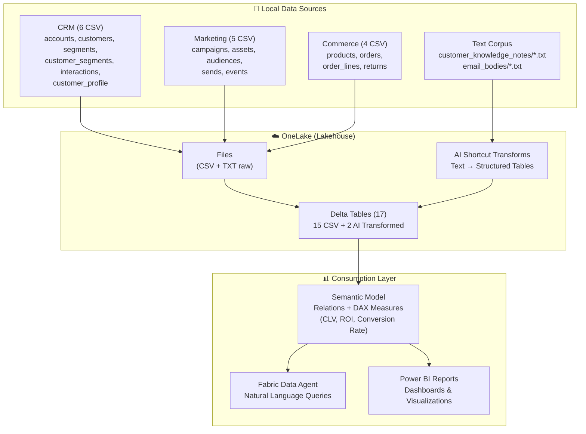

# Customer 360 + CRM + Marketing Campaigns + Commerce - Microsoft Fabric Demo

Démo complète Microsoft Fabric illustrant **OneLake**, **Shortcuts**, **AI Transformations**, et **Fabric Data Agent** avec un cas d'usage **Customer 360** (CRM + Marketing + Commerce).

---

## 🎯 Objectif

Démontrer Microsoft Fabric avec :
- **15 tables relationnelles** (CRM, Marketing, Commerce)
- **Corpus texte** (customer knowledge notes + email bodies)
- **Attribution marketing** (last-touch, ROI, segmentation)
- **AI Transformations** (sentiment, PII redaction, entity extraction)
- **Data Agent** pour questions métier en langage naturel

---

## 📐 Architecture



---

## 📊 Données Générées

### Tables CRM (6)
| Table | Lignes | Description |
|-------|--------|-------------|
| `crm_accounts` | 2 000 | Comptes entreprises (B2B) |
| `crm_customers` | 20 000 | Clients individuels (B2C/B2B) |
| `crm_segments` | 40 | Segments clients (High Value, At Risk...) |
| `crm_customer_segments` | 60 000 | Association clients ↔ segments |
| `crm_interactions` | 80 000 | Interactions CRM (tickets, appels...) |
| `crm_customer_profile` | 20 000 | Profils enrichis (CLV, NPS, churn risk) |

### Tables Marketing (5)
| Table | Lignes | Description |
|-------|--------|-------------|
| `marketing_campaigns` | 20 | Campagnes marketing (email) |
| `marketing_assets` | 60 | Assets email (templates A/B) |
| `marketing_audiences` | 40 | Audiences ciblées (campagnes ↔ segments) |
| `marketing_sends` | 200 000 | Envois d'emails individuels |
| `marketing_events` | 200 000 | Événements (open, click, bounce, unsub) |

### Tables Commerce (4)
| Table | Lignes | Description |
|-------|--------|-------------|
| `products` | 150 | Catalogue produits |
| `orders` | 60 000 | Commandes clients |
| `order_lines` | 180 000 | Lignes de commande (détail produits) |
| `returns` | 10 000 | Retours de commandes |

### Corpus Texte (2)
| Corpus | Fichiers | Description |
|--------|----------|-------------|
| `customer_knowledge_notes/*.txt` | 20 000 | Notes CRM par client (avec PII fictives) |
| `email_bodies/*.txt` | 60 | Corps des emails marketing |

**Total** : 15 tables + 2 corpus texte = **17 sources de données**

---

## 🚀 Quick Start

### 1. Générer les Données

```powershell
# Cloner le repo et installer les dépendances
cd "Scenario 3 - Marketing Campagn\src"
pip install -r ..\requirements.txt

# Générer toutes les données
python generate_data.py

# Durée : ~3-5 minutes
```

**Output attendu** :
- `data/raw/crm/` : 6 fichiers CSV
- `data/raw/marketing/` : 5 fichiers CSV
- `data/raw/commerce/` : 4 fichiers CSV
- `data/raw/text/customer_knowledge_notes/` : 20 000 fichiers .txt
- `data/raw/text/email_bodies/` : 60 fichiers .txt

---

### 2. Déployer dans Microsoft Fabric

Suivre le guide détaillé : [`docs/fabric_setup.md`](docs/fabric_setup.md)

**Étapes clés** :
1. Créer un Lakehouse
2. Uploader CSV et TXT vers OneLake
3. Appliquer AI Transformations sur corpus texte
4. Charger CSV en Delta Tables
5. Créer Semantic Model (relations + mesures DAX)
6. Configurer Fabric Data Agent

**Durée estimée** : 45-60 minutes

---

### 3. Tester le Data Agent

Poser les questions (voir [`docs/questions_demo.md`](docs/questions_demo.md)) :

- "Quel est le ROI moyen de nos campagnes marketing ?"
- "Quel segment a le meilleur taux de conversion ?"
- "Combien de clients sont à risque de churn ?"
- "Les A/B tests apportent-ils de la valeur ?"
- "Quelle est la corrélation entre open rate et conversion ?"

---

## 📚 Documentation

| Fichier | Description |
|---------|-------------|
| [`docs/dax_measures.md`](docs/dax_measures.md) | **NOUVEAU** - 40+ mesures DAX validées et testées |
| [`src/validate_schema.py`](src/validate_schema.py) | **NOUVEAU** - Script de validation des schémas et colonnes |
| [`docs/schema.md`](docs/schema.md) | Schéma complet (15 tables + relations + DAX) |
| [`docs/demo_story.md`](docs/demo_story.md) | Scénario narratif "Du Lead au Champion" |
| [`docs/questions_demo.md`](docs/questions_demo.md) | 15 questions pour Data Agent |
| [`docs/fabric_setup.md`](docs/fabric_setup.md) | Guide de déploiement Fabric (step-by-step) |
| [`docs/data_agent_instructions.md`](docs/data_agent_instructions.md) | System prompt Data Agent (version verbose avec emojis) |
| [`docs/data_agent_examples.md`](docs/data_agent_examples.md) | 20 exemples Q&A détaillés |
| [`AGENTS.md`](AGENTS.md) | Conventions développement + helpers |
| [`.github/copilot-instructions.md`](.github/copilot-instructions.md) | Instructions GitHub Copilot |

---

## 🔧 Configuration

### Modifier les Volumes

Éditer [`src/config.yaml`](src/config.yaml) :

```yaml
volumes:
  accounts: 2000        # → Changer pour +/- de comptes
  customers: 20000      # → Changer pour +/- de clients
  campaigns: 20         # → Nombre de campagnes
  sends: 200000         # → Nombre d'envois email
  # ... etc
```

Puis relancer `python generate_data.py`.

---

### Modifier les Comportements Métier

Éditer les **taux de conversion**, **open rates**, **A/B lift** :

```yaml
business_params:
  marketing_event_rates:
    open_rate_baseline: 0.22      # 22% open rate
    click_rate_baseline: 0.08     # 8% click rate
  
  conversion_baseline: 0.02       # 2% conversion sans campagne
  conversion_post_click: 0.12     # 12% après click
  
  ab_test_lift:
    open_lift_range: [0.05, 0.20]  # +5% à +20% variant B
```

---

## 🎯 Use Cases Démontrables

### 1. Attribution Marketing (Last-Touch)

**Question** : Quel revenue est attribuable aux campagnes marketing ?

**Réponse** : Jointure `orders.attributed_campaign_id` → `campaigns.campaign_id` (fenêtre 14 jours post-click).

**Résultat attendu** : ~9% des commandes attribuées, mais 18% du revenue (panier moyen plus élevé).

---

### 2. Segmentation & Ciblage

**Question** : Quels segments répondent le mieux aux campagnes ?

**Analyse** : Croiser `marketing_audiences` (segments ciblés) avec `marketing_events` (open/click) et `orders` (conversion).

**Résultat attendu** : "Frequent Buyers" et "High Value" ont conversion 5-10× supérieure vs "New Leads".

---

### 3. A/B Testing Impact

**Question** : Les variants B performent-ils mieux que les variants A ?

**Analyse** : Comparer `marketing_events` (open/click rates) entre assets variant A vs B.

**Résultat attendu** : Variant B : +10-30% open rate, +15-40% click rate en moyenne.

---

### 4. CLV & Churn Prediction

**Question** : Quels clients ont le plus de valeur ? Lesquels risquent de partir ?

**Analyse** : Utiliser `crm_customer_profile` (clv_score, churn_risk_score) + segmentation.

**Résultat attendu** : 
- Top 10% CLV = 50% du revenue
- 20% clients avec churn_risk > 60 (segment "At Risk")

---

### 5. Sentiment Analysis (AI Transforms)

**Question** : Les clients avec sentiment négatif achètent-ils moins ?

**Analyse** : AI Transformation sur `customer_knowledge_notes/*.txt` → extraire sentiment → joindre avec `orders`.

**Résultat attendu** : Sentiment négatif = conversion 0.9% vs 14% pour sentiment positif.

---

## 🚨 Troubleshooting

### Erreur : Dates en STRING au lieu de TIMESTAMP

**Solution** : Caster manuellement dans Fabric Lakehouse.

```python
from pyspark.sql.functions import to_timestamp
df = df.withColumn("order_at", to_timestamp("order_at", "yyyy-MM-dd HH:mm:ss"))
```

---

### Erreur : Relations cassées (FK orphelines)

**Cause** : Génération de données incohérente.

**Solution** : Vérifier la cohérence référentielle :

```sql
-- Tous les customer_id dans orders existent ?
SELECT COUNT(*) FROM orders o 
LEFT JOIN customers c ON o.customer_id = c.customer_id 
WHERE c.customer_id IS NULL;
-- Attendu : 0
```

Si > 0, régénérer les données avec nouveau seed.

---

### Erreur : AI Transformations échouent

**Cause** : Fichiers .txt mal encodés ou trop volumineux.

**Solution** :
- Vérifier encoding UTF-8 (pas UTF-16)
- Réduire volume test (ex: 1 000 fichiers au lieu de 20 000)
- Vérifier quotas AI Transformations du tenant

---

## 📊 Métriques Clés (DAX)

### CLV (Customer Lifetime Value)

```dax
CLV = SUM(orders[total_amount_eur]) * AVERAGE(products[margin_pct])
```

### Conversion Rate

```dax
Conversion_Rate = DIVIDE(COUNTROWS(FILTER(customers, customers[total_orders] > 0)), COUNTROWS(customers), 0)
```

### Campaign ROI

```dax
Campaign_ROI = 
VAR Revenue = CALCULATE(SUM(orders[total_amount_eur]), orders[attributed_campaign_id] <> BLANK())
VAR Cost = SUM(campaigns[budget_eur])
RETURN DIVIDE(Revenue - Cost, Cost, 0)
```

### Open Rate

```dax
Open_Rate = DIVIDE(COUNTROWS(FILTER(marketing_events, marketing_events[event_type] = "open")), COUNTROWS(sends), 0)
```

### CTR (Click-Through Rate)

```dax
CTR = 
VAR Opens = COUNTROWS(FILTER(marketing_events, marketing_events[event_type] = "open"))
VAR Clicks = COUNTROWS(FILTER(marketing_events, marketing_events[event_type] = "click"))
RETURN DIVIDE(Clicks, Opens, 0)
```

---

## 🔐 Données & Conformité

**IMPORTANT** : Toutes les données sont **100% synthétiques** (générées par Faker).

- ✅ Aucune PII réelle
- ✅ Emails fictifs (@example.com)
- ✅ Téléphones fictifs (formats français)
- ✅ Noms générés aléatoirement

**PII fictives** dans corpus texte (`customer_knowledge_notes`) sont **volontairement incluses** pour démontrer **AI PII Redaction** dans Fabric.

---

## 🤝 Contributions

Pour améliorer le repo :
1. Consulter [`AGENTS.md`](AGENTS.md) (conventions)
2. Modifier `src/config.yaml` ou `src/generate_data.py`
3. Régénérer les données
4. Mettre à jour la documentation (`docs/schema.md`, etc.)

---

## 📞 Support

- **Questions techniques** : Voir `docs/fabric_setup.md`
- **Documentation Fabric** : https://learn.microsoft.com/en-us/fabric/
- **Problèmes génération données** : Consulter `AGENTS.md`

---

**Bravo ! Vous êtes prêt à démontrer Microsoft Fabric avec un cas d'usage Customer 360 complet.** 🚀

*Générez les données, déployez dans Fabric, et posez vos questions au Data Agent !*


